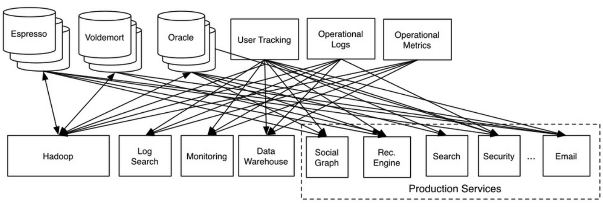
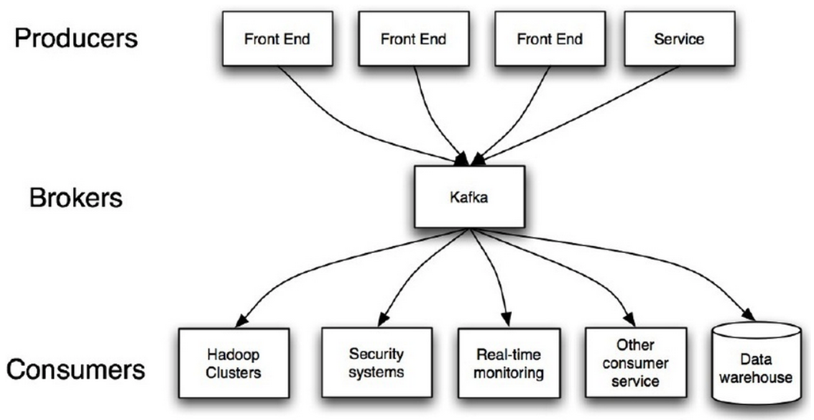
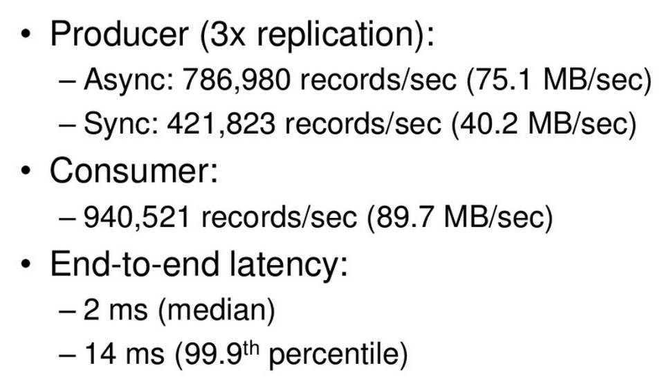
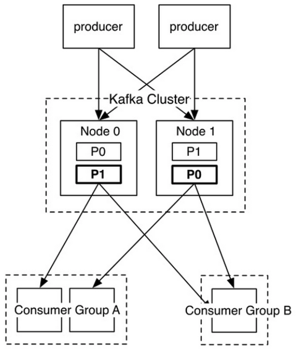
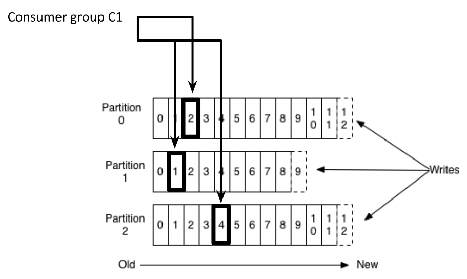

:toc:

== Apache Kafka is

[incremental="true"]
* Messaging System
** Note: 일반적으로 Messaging System에는 Queue와 Topic 방식이 존재, 예) JMS
* Distributed Messaging System
* Distributed Publish-Subscribe Messaging System
* Distributed Streaming Platform
* Data Hub
* *Data Platform*

== Before Kafka

* 열심히 일 할수록...

[incremental="true"]

== After Kafka

[incremental="true"]
* Data Hub

[incremental="true"]
image::images/kafka_01.png[title="Kafka"]

== Kafka High-level View

[incremental="true"]

== Kafka High-level View

* https://en.wikipedia.org/wiki/Publish%E2%80%93subscribe_pattern[Publish–subscribe pattern]
** Messaging system의 topic에 적용되는 개념
* Event-driven architecture

== Apache Kafka is

[incremental="true"]
* Pub-sub 방식의 고성능 Distributed Messaging System
* LinkedIn SNA팀에서 개발하고 서비스에 사용 중
** Since 2011
** Jay Kreps
** Scala, Java
* LinkedIn에서 2014년 기준 300개가 넘는 broker 운영
** 18,000개의 topic
** daily 2,200억 message 처리 

== Kafka Three Design Principles

[incremental="true"]
* Very simple API for both producers and consumers
* Low overhead in network transferring as well as on-disk storage
* Scaled out architecture from the beginning

== Kafka Performance

[incremental="true"]

== Kafka Producer Performance

[incremental="true"]
image::https://t1.daumcdn.net/cfile/tistory/23441B445509177A1F[title="Kafka Producer Performance"]

== Kafka Consumer Performance

[incremental="true"]
image::https://t1.daumcdn.net/cfile/tistory/217D7945550917BD0B[title="Kafka Consumer Performance"]

== Kafka Overview

[incremental="true"]
* 사용하기 쉬운 API, 설정 옵션 제공
* Messaging system의 Queue와 Topic 이 합쳐진 개념
* Topic 으로 통일
* Zero-copy 방식으로 고성능 읽기 기능 제공
** https://docs.oracle.com/javase/8/docs/api/java/nio/channels/FileChannel.html#transferTo-long-long-java.nio.channels.WritableByteChannel-[java.nio.channels
Class FileChannel.transferTo()]
** https://github.com/apache/kafka/blob/trunk/clients/src/main/java/org/apache/kafka/common/record/FileRecords.java#L283-L285[FileRecords.java], https://github.com/apache/kafka/blob/trunk/clients/src/main/java/org/apache/kafka/common/network/TransportLayer.java#L101-L115[TransportLayer.java], https://github.com/apache/kafka/blob/trunk/clients/src/main/java/org/apache/kafka/common/network/PlaintextTransportLayer.java#L214-L217[PlaintextTransportLayer.java]
* Scale-out 하기 좋은 시스템
* Batch 단위 전송, Compression 기능 제공
** GZIP and Snappy

== Kafka Overview

[incremental="true"]
* Producer측에서 partitioner를 구현해 분산 저장 조절 가능
** DefaultPartitioner를 사용하면 랜덤
* Kafka + Processing 구조로 활용
** Storm, Spark Streaming
* Streaming 처리 KSQL 제공
* 로그 데이터 유지하면서 Upgrade 가능

== High-level Architecture

[incremental="true"]
image::images/kafka_04.png[title="Kafka"]

== Producing & Consuming

* 네모 박스 하나가 하나의 process
* 화살표선 하나가 하나의 thread

[incremental="true"]

== Producing & Consuming

[incremental="true"]

== Kafka Log

[incremental="true"]
image::http://kafka.apache.org/11/images/kafka_log.png[title="Kafka Overview"]

== How Kafka stores data on disk

* How Kafka’s Storage Internals Work
** https://thehoard.blog/how-kafkas-storage-internals-work-3a29b02e026

* kafka.tools.DumpLogSegments since 1.1.0
** https://github.com/apache/kafka/blob/trunk/core/src/main/scala/kafka/tools/DumpLogSegments.scala
** https://github.com/apache/kafka/blob/trunk/core/src/test/scala/unit/kafka/tools/DumpLogSegmentsTest.scala

[source,sh]
----
$ bin/kafka-run-class.sh kafka.tools.DumpLogSegments --deep-iteration --print-data-log --files /data/kafka/events-1/00000000003065011416.log | head -n 4
Dumping /data/kafka/appusers-1/00000000003065011416.log
Starting offset: 3065011416
offset: 3065011416 position: 0 isvalid: true payloadsize: 2820 magic: 1 compresscodec: NoCompressionCodec crc: 811055132 payload: {"name": "Travis", msg: "Hey, what's up?"}
offset: 3065011417 position: 1779 isvalid: true payloadsize: 2244 magic: 1 compresscodec: NoCompressionCodec crc: 151590202 payload: {"name": "Wale", msg: "Starving."}
----

== Latest Kafka (version 1.x)

[incremental="true"]
image::http://kafka.apache.org/11/images/kafka-apis.png[title="Kafka Overview"]

//image::http://kafka.apache.org/11/images/tracking_high_level.png[title="Kafka Overview"]
//image::http://kafka.apache.org/11/images/producer_consumer.png[title="Kafka Overview"]
//image::http://kafka.apache.org/11/images/log_anatomy.png[title="Kafka Overview"]
//image::http://kafka.apache.org/11/images/log_consumer.png[[alt=Flower,width=10%,height=10%]
//image::http://kafka.apache.org/11/images/consumer-groups.png[title="Kafka Overview"]

//== Kafka Log

//[incremental="true"]
//image::http://kafka.apache.org/11/images/log_cleaner_anatomy.png[title="Kafka Overview"]

//== Kafka Log

//[incremental="true"]
//image::http://kafka.apache.org/11/images/log_compaction.png[title="Kafka Overview"]

//image::http://kafka.apache.org/11/images/streams-concepts-topology.jpg[title="Kafka Overview"]

== Kafka Mirroring

[incremental="true"]
image::http://kafka.apache.org/11/images/mirror-maker.png[title="Kafka Overview"]

== Kafka Mirroring

[incremental="true"]
image::http://kafka.apache.org/11/images/kafka_multidc.png[title="Kafka Overview"]

== Kafka Mirroring

[incremental="true"]
image::http://kafka.apache.org/11/images/kafka_multidc_complex.png[title="Kafka Overview"]

== Kafka Streams

[incremental="true"]
image::http://kafka.apache.org/11/images/streams-architecture-overview.jpg[title="Kafka Overview"]

//image::http://kafka.apache.org/11/images/streams-architecture-tasks.jpg[title="Kafka Overview"]

== Kafka Streams

[incremental="true"]
image::http://kafka.apache.org/11/images/streams-architecture-states.jpg[title="Kafka Overview"]

== Disk Design Consideration

* http://kafka.apache.org/documentation/#diskandfs
* Using multiple drives to get good throughput 
* Not sharing drives for Kafka & app logs & OS
* RAID into a single volume
* Mount each drive as its own directory
* Kafka has replication provided at the application level
* choice has several tradeoffs.

* http://kafka.apache.org/documentation/#brokerconfigs
** log.dirs
* https://community.hortonworks.com/articles/80813/kafka-best-practices-1.html

//== Keywords

//* leader and followers
//* message rewind/replay
